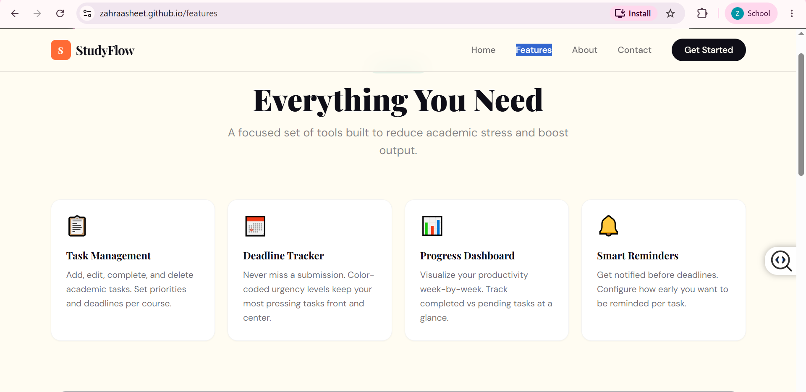
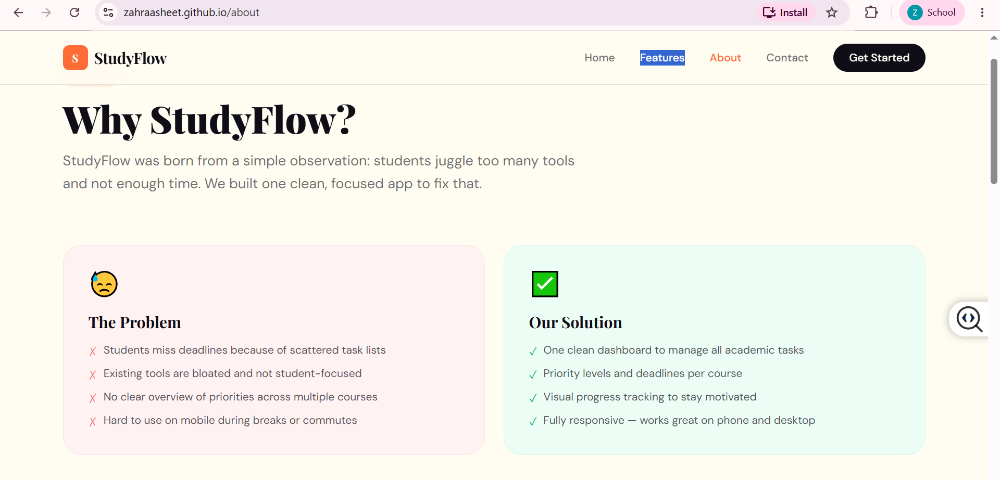
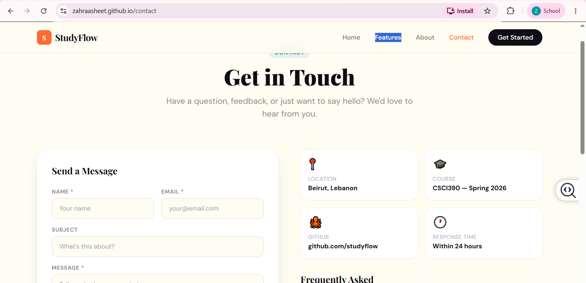

# StudyFlow — Academic Task Manager

> CSCI390: Web Programming — Project Phase 2 | Spring 2025/2026
> **Students:** Fatima Hariri & Zahraa Sheet | **Instructor:** Dr. Rabia Amro

## Project Description

**StudyFlow** is a responsive, student-focused academic task manager built with React JS and Tailwind CSS. It solves the real-world problem of students struggling to track deadlines and assignments across multiple courses. The app features a clean, modern UI with four fully responsive pages and an interactive task management system.

### Key Features
- Task Manager — Add, complete, and delete tasks by course and priority
- Deadline Tracker — Set due dates and filter by status (All / Pending / Done)
- Progress Bar — Visual indicator of task completion
- Responsive Design — Optimized for desktop, tablet, and mobile
- FAQ Accordion — Interactive collapsible Q&A on the Contact page
- Contact Form — Validated form with success state

---

## Pages

| Page | Route | Description |
|------|-------|-------------|
| Home | `/` | Hero section, stats bar, testimonials, CTA |
| Features | `/features` | Feature cards + live interactive task manager |
| About | `/about` | Problem/solution, timeline, tech stack, team |
| Contact | `/contact` | Contact form + FAQ accordion + info cards |

---

## Tech Stack

- **React JS 18** — Component-based frontend framework
- **Tailwind CSS v3** — Utility-first responsive styling
- **React Router DOM v6** — Client-side routing
- **Google Fonts** — Playfair Display + DM Sans
- **GitHub Pages** — Hosting and deployment
- **Git** — Version control

---

## Setup Instructions

### Prerequisites
Node.js v18+ and npm installed on your machine.

### Install and Run Locally

```bash
# 1. Clone the repository
git clone https://github.com/ZahraaSheet/studyflow.git
cd studyflow

# 2. Install dependencies
npm install

# 3. Start the development server
npm start
# Opens at http://localhost:3000
```

### Build for Production

```bash
npm run build
```

### Deploy to GitHub Pages

```bash
# 1. Add to package.json (at the top level):
#    "homepage": "https://ZahraaSheet.github.io/studyflow"

# 2. Install gh-pages
npm install --save-dev gh-pages

# 3. Add to package.json scripts section:
#    "predeploy": "npm run build",
#    "deploy": "gh-pages -d build"

# 4. Run the deploy command
npm run deploy
```

---

## Project Structure

```
studyflow/
├── public/
│   └── index.html
├── src/
│   ├── components/
│   │   ├── Navbar.jsx        # Sticky responsive nav with mobile hamburger
│   │   └── Footer.jsx        # Site-wide footer
│   ├── pages/
│   │   ├── Home.jsx          # Landing page — hero, stats, testimonials
│   │   ├── Features.jsx      # Feature showcase + live task manager
│   │   ├── About.jsx         # Team, timeline, tech stack
│   │   └── Contact.jsx       # Contact form + FAQ accordion
│   ├── App.js                # Router and layout setup
│   ├── index.css             # Tailwind + Google Fonts
│   └── index.js              # React entry point
├── tailwind.config.js        # Custom theme (colors, fonts)
├── package.json
└── README.md
```

---

## Screenshots

| Home Page | Features Page |
|-----------|--------------|
|  |  |

| About Page | Contact Page |
|-----------|--------------|
|  |  |

---

## Group Contribution Statement

| Member | Role | Contribution |
|--------|------|-------------|
| Fatima Hariri | Lead Developer | App architecture, routing, Home & Features pages |
| Zahraa Sheet | Frontend Developer | About & Contact pages, responsive layout, styling |

---

## Academic Integrity

This project is original work created for CSCI390 Web Programming, Spring 2025/2026,
under the supervision of Dr. Rabia Amro. No pre-built templates were used.
